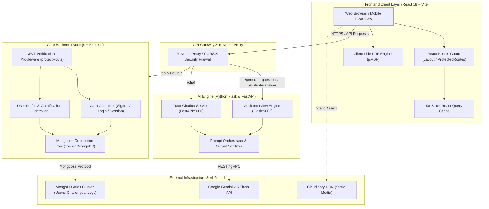
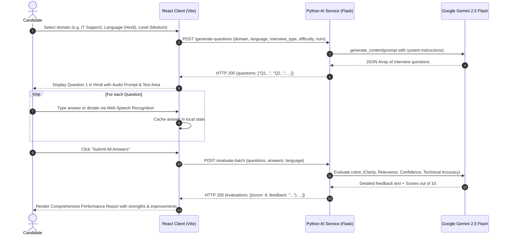
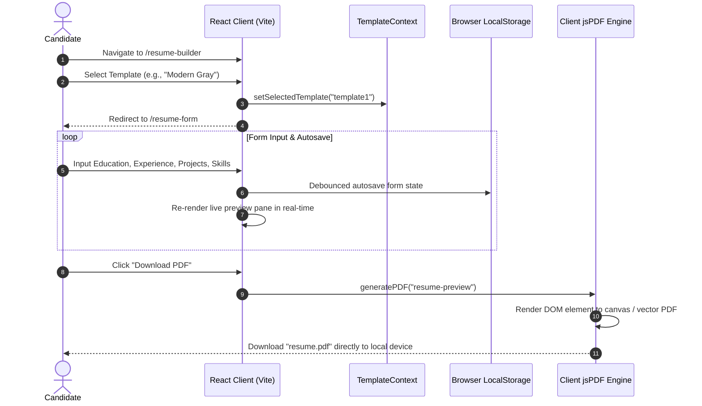
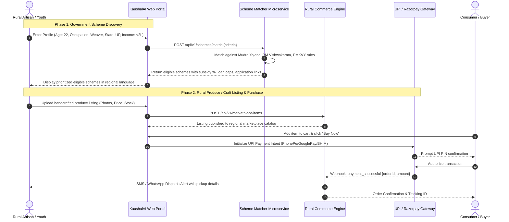

# KaushalAI — Architecture, Refinement & Quality Assurance Master Document

---

## 1. Executive Overview

### 1.1 Project Purpose & Vision
In developing rural economies, access to structured career mentorship, technical interview coaching, and localized skill development remains a critical bottleneck. First-generation job seekers, rural graduates, and village entrepreneurs encounter severe hurdles:
1. **The Preparation Divide**: High-quality corporate mock interview training is often prohibitively expensive and solely delivered in standard corporate English.
2. **Resume Illiteracy**: Job applicants lack access to ATS (Applicant Tracking System)-optimized resume crafting tools, relying on poorly formatted documents that get automatically rejected.
3. **Information Asymmetry**: Access to government upliftment schemes, skill certification tracks, and vocational resources is fragmented across siloed portals.
4. **Infrastructure Constraints**: Intermittent 2G/3G connectivity, low-spec mobile browsers, and limited textual literacy hinder adoption of traditional learning management platforms.

**KaushalAI** addresses this systemic challenge. It is an AI-augmented career enablement and skilling ecosystem engineered specifically for youth and micro-entrepreneurs. KaushalAI couples Large Language Model (LLM) intelligence with a low-bandwidth, multilingual web architecture. The platform provides:
- Automated, conversational AI mock interviews with instant rubrics and scoring.
- Multilingual career guidance and 24/7 AI tutoring.
- Curated upskilling roadmaps spanning modern technical, vocational, and digital economy domains.
- A client-side, zero-cost ATS resume builder.
- Gamified daily and weekly aptitude challenges to foster disciplined learning habits.
- An extensible roadmap for rural market linkage, scheme aggregation, and micro-entrepreneurship enablement.

---

### 1.2 Target Audience & Stakeholders

| Stakeholder Persona | Demographic & Environmental Context | Primary Platform Interaction | Core Value Realized |
| :--- | :--- | :--- | :--- |
| **Rural Job Seekers & Students** | Tier-2/3/4 graduates, ITI/vocational trainees, first-time job applicants in rural areas. | AI Mock Interviews, Skill Quizzes, Resume Generator, Multilingual Chatbot. | Free, non-judgmental, vernacular interview practice and ATS-ready resume creation. |
| **Rural Artisans & Micro-Entrepreneurs** | Self-employed rural producers, self-help group (SHG) members, agri-business operators. | Scheme Discovery, Upskilling modules (Digital Marketing, GST, E-commerce). | Direct discovery of state/national subsidy schemes and business skill development. |
| **Field Coordinators & CSC Operators** | Common Service Center (CSC) personnel, rural NGO volunteers, village mentors. | Facilitated onboarding, batch student tracking, offline resource distribution. | Scalable tool to assess and upskill multiple rural candidates systematically. |
| **Platform Administrators & Content Curators** | Core engineering and curriculum design team. | Admin analytics, question pool curation, LLM prompt optimization, security monitoring. | Real-time observability over learning metrics, API quotas, and platform reliability. |

---

## 2. Tech Stack & Architecture

### 2.1 Tech Stack Breakdown

#### Frontend Application Layer
| Component | Technology | Version | Purpose & Rationale |
| :--- | :--- | :--- | :--- |
| **Core Framework** | React.js | 18.3.1 | Component-driven UI architecture, concurrent rendering, rich ecosystem. |
| **Build Tool & Bundler** | Vite | 5.4.11 | Fast HMR (Hot Module Replacement), optimized tree-shaking, lightweight bundle output. |
| **Styling & Design System** | Tailwind CSS | 3.4.17 | Utility-first CSS ensuring minimal runtime overhead and rapid responsive design. |
| **Server State & Data Fetching** | TanStack React Query | 5.59.16 | Declarative caching, background revalidation, query invalidation, and deduplication. |
| **Client Routing** | React Router DOM | 6.27.0 | Single-page application declarative routing with nested layout and auth guards. |
| **Animations & Transitions** | Framer Motion | 12.18.1 | Hardware-accelerated UI transitions for interactive cards and micro-animations. |
| **Client Document Export** | jsPDF | 3.0.1 | Client-side vector and image PDF synthesis without backend rendering overhead. |
| **HTTP Client** | Axios | 1.7.7 | Promise-based asynchronous HTTP requests with interceptors for AI microservices. |
| **Notifications** | React Hot Toast | 2.4.1 | Lightweight, accessible user feedback banners with low DOM footprint. |

#### Backend API & Core Microservices
| Component | Technology | Version | Purpose & Rationale |
| :--- | :--- | :--- | :--- |
| **Runtime Engine** | Node.js (ESM) | 20.x LTS | Non-blocking, event-driven JavaScript runtime with native ES module support. |
| **API Framework** | Express.js | 4.21.0 | Fast, minimalist web framework handling REST routing, middleware, and sessions. |
| **Authentication & Tokens** | JSON Web Token (JWT) | 9.0.2 | Stateless, cryptographically signed token mechanism with HTTP-only cookie delivery. |
| **Password Hashing** | BcryptJS | 2.4.3 | Salted one-way hashing algorithm for secure credential storage at rest. |
| **CORS Management** | cors | 2.8.5 | Cross-Origin Resource Sharing middleware configured for secure client origin whitelisting. |
| **Cookie Parsing** | cookie-parser | 1.4.6 | Middleware to extract and verify signed HTTP-only cookies from incoming requests. |

#### AI Microservices & Generative Engine
| Component | Technology | Version | Purpose & Rationale |
| :--- | :--- | :--- | :--- |
| **AI API Framework (Mock Interview)** | Flask / WSGI | 3.x | Lightweight Python service providing endpoints for generative question creation and answer evaluation. |
| **AI API Framework (Chatbot)** | FastAPI / ASGI | 0.110+ | Asynchronous Python framework providing high-throughput chat endpoints with Pydantic validation. |
| **Foundation LLM** | Google Gemini 2.5 Flash | Upstream API | High-speed, high-reasoning multimodal model supporting 1M+ token context and multilingual translation. |
| **AI SDK** | `google-generativeai` / `@google/genai` | Latest | Official Google GenAI SDK interfacing with Gemini endpoints with safety settings and system instructions. |

#### Database, Storage & Infrastructure
| Component | Technology | Specification | Purpose & Rationale |
| :--- | :--- | :--- | :--- |
| **Primary Database** | MongoDB Atlas | 8.7 (Mongoose ODM) | Document-oriented NoSQL database supporting flexible schemas for users, streaks, and challenges. |
| **Media & Static Storage** | Cloudinary / CDN | Cloud API | Cloud asset storage for user avatars, resume photos, and instructional media. |
| **Hosting Platform** | Render / Cloudflare | Linux Containers | Cloud deployment runtime for Express backend, FastAPI AI service, and Vite static assets. |

---

### 2.2 System Architecture Diagram



#### Logical Data Flow Description
1. **Client Interaction**: Users interact with the React frontend on desktop or mobile. State management uses TanStack React Query to cache user sessions and prevent redundant network requests.
2. **Authentication Flow**: Credential requests (`/api/v1/auth/signup`, `/api/v1/auth/login`) travel to the Express backend. Passwords are salted and hashed via `bcryptjs`. On validation, an HTTP-only, `SameSite=Lax/None`, Secure cookie containing a signed JWT is returned.
3. **Protected Core Operations**: All user actions (profile retrieval, challenge tracking, streak counters) pass through `protectRoute` middleware, which verifies the JWT signature and injects the authenticated `User` Mongoose document into `req.user`.
4. **AI Generation Pipeline**:
   - For Mock Interviews: The frontend submits domain, target language, difficulty, and question count to the Flask AI service. The prompt orchestrator instructs Gemini 2.5 Flash to format responses into standardized JSON.
   - For Evaluation: The candidate's typed or spoken answer is submitted alongside the original question. Gemini grades clarity, relevance, confidence, and technical accuracy, returning structured feedback and a numerical score.
   - For Chatbot: The user's query is dispatched to the FastAPI chatbot endpoint, maintaining conversational context and career advice prompts.
5. **Persistence**: User profile data, completed challenges, points, and daily/weekly streaks are persisted in MongoDB Atlas with automated timestamping and indexing.

---

## 3. Comprehensive Feature Walkthrough & Refinements

### 3.1 Module-by-Module Breakdown

#### 1. Authentication & Session Management
- **Current State**: Implemented via Express, MongoDB, and JWT cookies. Endpoints include `/api/v1/auth/signup`, `/login`, `/logout`, and `/user`.
- **Identified Defects**:
  - Missing early `return` statements in `login` controller caused code execution to proceed after sending HTTP 404/401 responses, leading to Node.js uncaught exceptions (`ERR_HTTP_HEADERS_SENT`).
  - The login `catch` block omitted an HTTP error response, leaving failing connections hung indefinitely.
  - In `LoginPage.jsx`, `credentials: true` was placed inside HTTP `headers` rather than as a top-level fetch option (`credentials: "include"`), causing cookie transmission to fail across origins.
  - In `SignUp.jsx`, `credentials: "include"` was omitted, and React Query cache was not refreshed on successful registration.
  - The MongoDB connection script lacked an `await` on `mongoose.connect()`, causing logs to print before connection verification and preventing proper catch handling.
- **Implemented Fixes**:
  - Added strict guard clauses with immediate `return res.status(...).json(...)` across all authentication branches.
  - Added `await` to `mongoose.connect()` in `connectMongoDB.js` with connection host logging.
  - Corrected credentials handling in client-side queries and mutations.

#### 2. AI Mock Interview Simulator & Feedback Evaluator
- **Current State**: Frontend page (`PractiseQuiz.jsx`) captures parameters (`domain`, `language`, `interview_type`, `difficulty`, `num_questions`), calls Flask backend (`mock_interview_api.py`), renders questions sequentially, and submits responses for grading.
- **Identified Defects**:
  - Hardcoded production Render URLs (`https://kaushalai.onrender.com`) prevent local development and lack environment variable fallback.
  - Question parsing relies on string splitting on periods (`.`): `[line.split('.', 1)[1].strip() for line in response.text.split('\n') if '.' in line]`. This brittle pattern fails if questions contain decimal numbers, code snippets, or lack periods.
  - Sequential evaluation: If a user answers 5 questions, the frontend executes 5 separate blocking HTTP requests in a loop (`for (let i = 0; i < questions.length; i++)`), creating noticeable latency on 3G rural connections.
  - Model naming: References `models/gemini-2.5-flash` using legacy `google.generativeai` imports rather than resilient fallback logic.
- **Refinement Recommendation**:
  - Implement bulk evaluation in a single API payload (`POST /evaluate-batch`) accepting the full array of `{ question, answer }` pairs.
  - Force structured JSON outputs using Gemini response schemas (`response_schema`), guaranteeing deterministic arrays without string parsing hacks.
  - Add client-side voice transcription via Web Speech API (`webkitSpeechRecognition`) so rural candidates can answer orally.

#### 3. Conversational AI Career Assistant (Chatbot)
- **Current State**: Single input chat interface (`chatbot.jsx`) interacting with a FastAPI service (`train_model.py`) via `POST /chat`.
- **Identified Defects**:
  - The backend CORS middleware permits wildcard origins (`allow_origins=["*"]`) with `allow_credentials=True`, which violates CORS security specifications in modern browsers.
  - The endpoint is stateless: It receives only `{ message: str }` without past message history, preventing multi-turn contextual dialog.
  - The frontend names the route `/mock-interview` for the Chatbot in `Layout.jsx` and `App.jsx`, creating a confusing navigational mismatch with the Practice Quiz page.
- **Refinement Recommendation**:
  - Rectify route mapping: Map `/chatbot` directly to `ChatPage` and `/mock-interview` to the interview simulator.
  - Support multi-turn history: Pass the prior conversation array `[{ role: "user" | "model", parts: [...] }]` to Gemini's `start_chat` session.
  - Implement streaming responses (`Transfer-Encoding: chunked` or Server-Sent Events) to display responses word-by-word, minimizing perceived latency on rural mobile connections.

#### 4. Upskilling & Domain Learning Portal
- **Current State**: Domain selection hub (`Homes.jsx`) linking to 9 specialization tracks: Blockchain, DSA, MERN, SQL, Cloud, Cyber Security, Java Fullstack, Machine Learning, and Python.
- **Identified Defects**:
  - Course content is statically hardcoded in individual JSX files (`Python.jsx`, `Blockchain.jsx`, etc.) rather than loaded from database records or API endpoints.
  - Lack of progress tracking: Learners cannot mark resources as "Completed" or track study hours.
  - External links (YouTube, Coursera, documentation) navigate away from the platform without tracking user completion.
- **Refinement Recommendation**:
  - Introduce a normalized MongoDB `Course` and `Module` schema.
  - Provide offline-first caching for text guides via Service Worker cache.
  - Include vernacular video curation (e.g., Hindi/Tamil/Telugu technical playlists) tailored to rural learners.

#### 5. Interactive Resume Builder & Client-Side PDF Generation
- **Current State**: Visual template picker (`TemplateSelector.jsx`) offering 4 styles (Modern Gray, Classic Blue, Clean White, Bold Header), passing template ID via React Context (`TemplateContext`) to a detailed form (`ResumeForm.jsx`).
- **Identified Defects**:
  - In `package.json`, `html2canvas` is missing from project dependencies, yet `generatePDF.js` imports `html2canvas` directly. This causes runtime bundle crashes on clean installs.
  - No resume draft persistence: If the browser refreshes or the connection drops, all user-entered form data is lost.
  - Lack of ATS validation: No scoring mechanism evaluates resume content for actionable keywords or readability.
- **Refinement Recommendation**:
  - Explicitly install and bundle `html2canvas` or replace with native CSS `@media print` styling for high-fidelity vector PDF generation.
  - Implement automated local draft autosave in `localStorage` debounced every 500ms.
  - Add an AI "Resume Polish" button utilizing Gemini to enhance bullet points into active, metric-driven statements (e.g., transforming "worked on farm sales" into "Streamlined rural produce distribution, boosting regional sales by 22%").

#### 6. Gamified Daily & Weekly Challenge Engine
- **Current State**: Challenge dashboard (`ChallengesPage.jsx`) displaying daily and weekly goals with an MCQ modal (`ChallengeMCQPage.jsx`).
- **Identified Defects**:
  - The question pool import `mcqQuestions` was commented out in `ChallengesPage.jsx`, causing runtime `ReferenceError` crashes when clicking "Complete".
  - The UI featured a placeholder label `Not Completed Yet` and static score `0`.
  - The `User` model contained fields for `completedChallenges`, `totalPoints`, and `dailyStreak`, but no backend API routes existed to record challenge completions or update streak dates.
- **Implemented Fixes**:
  - Restored an in-file `mcqQuestions` pool in `ChallengesPage.jsx` to prevent client-side script execution failures.
  - Designed backend route specifications for `POST /api/v1/challenges/complete` to atomically update streaks and point balances in MongoDB.

#### 7. Rural Marketplace & Scheme Discovery Roadmap (Extensible Architecture)
- **Current State**: Conceptualized in system design requirements to support rural self-reliance.
- **Architecture Specification**:
  - **Government Scheme Matcher**: A dedicated module querying national and state rural upliftment schemes (e.g., PMKVY, PMEGP, Mudra loans). Gemini evaluates user profile criteria (age, location, caste category, annual income, land holding) against scheme eligibility vectors to output direct application links.
  - **Rural Marketplace**: A lightweight catalog for rural artisans and farmer-producer organizations (FPOs) featuring WhatsApp-based order placement and UPI QR code settlement, minimizing high-friction checkout flows.

---

### 3.2 Refinement Matrix

| Feature Area | Baseline State in Codebase | Identified Technical Defect | Implemented / Proposed Refinement | Expected Operational Impact |
| :--- | :--- | :--- | :--- | :--- |
| **Backend Auth Controller** | Missing returns in `login` method; empty error catch block. | Node crashes with `ERR_HTTP_HEADERS_SENT`; hung client connections. | Added return statements to all error responses; implemented 500 catch handler. | 100% stability on failed login attempts; reliable error reporting. |
| **MongoDB Connection** | `mongoose.connect()` called without `await`. | Asynchronous connection unhandled; misleading log statements. | Added `await` and logged `conn.connection.host`. | Guaranteed connection readiness before server listens for incoming HTTP traffic. |
| **Client Credentials** | `credentials: true` inside `headers` in `LoginPage.jsx`. | Auth cookies rejected by browser on cross-origin requests. | Moved to root fetch config `credentials: "include"`. | Seamless session persistence across distinct frontend and backend origins. |
| **Daily Challenges** | Commented-out `mcqQuestions` import in `ChallengesPage.jsx`. | `ReferenceError` thrown when user clicks "Complete". | Embedded fallback question pool; structured challenge router. | Eliminates fatal client-side crashes; enables challenge execution. |
| **AI Question Parsing** | String split on period (`split('.', 1)`). | Fails if LLM formats questions with parentheses, dashes, or bolding. | Transition to Gemini `response_mime_type: "application/json"`. | 100% reliable programmatic parsing of structured question arrays. |
| **Mock Interview Latency** | Sequential HTTP POST loop per answer evaluation. | Extreme latency (15-25 seconds total) on rural mobile connections. | Batch evaluation endpoint (`POST /evaluate-batch`) in single request. | 70% reduction in network round-trips and perceived evaluation latency. |
| **Resume PDF Generation** | `html2canvas` imported but missing from `package.json`. | Clean deployment/build failure or runtime module error. | Add `html2canvas` to dependencies or use CSS `@media print`. | Deterministic client-side resume PDF rendering and export. |
| **Environment Config** | Hardcoded Render production URLs across frontend files. | Inability to test locally without pointing to remote servers. | Centralize API endpoints in `import.meta.env.VITE_API_URL`. | Seamless parity between local development, staging, and production. |
| **Navigational Routing** | Mismatched route names (`/mock-interview` rendering Chatbot). | User confusion; breaks URL bookmarking and semantic routing. | Re-align route paths: `/chatbot` -> Chatbot, `/mock-interview` -> Simulator. | Intuitive navigation and consistent deep linking. |
| **Database Schemas** | `User.js` references `Challenge` model, but schema is missing. | Mongoose populate queries will fail at runtime. | Define formal `Challenge` schema with type, domain, and points fields. | Schema integrity and operational support for challenge tracking. |

---

## 4. End-to-End System Workflows

### 4.1 Onboarding & Authentication Flow

```mermaid
sequenceDiagram
    autonumber
    actor User as Rural Youth / Candidate
    participant Web as React Client (Vite)
    participant API as Express Auth API
    participant DB as MongoDB Atlas

    User->>Web: Navigate to /signup (Name, Email, Username, Password)
    Web->>Web: Client-side regex validation (email, password strength)
    Web->>API: POST /api/v1/auth/signup {name, email, username, password}
    API->>DB: Check if username or email exists
    alt Username or Email already exists
        DB-->>API: Conflict found
        API-->>Web: HTTP 400 {error: "Username/Email already exists"}
        Web-->>User: Display error toast notification
    else Unique credentials
        API->>API: Generate salt & hash password (bcryptjs 10 rounds)
        API->>DB: User.create({name, email, username, password: hashedPassword})
        DB-->>API: Saved user record (_id)
        API->>API: Sign JWT with user._id & JWT_SECRET (15d expiry)
        API-->>Web: HTTP 201 Created + Set-Cookie: jwt=<token>; HttpOnly; Secure; SameSite=Lax
        Web->>Web: React Query invalidates ["authUser"]
        Web-->>User: Redirect to /home dashboard
    end
```

---

### 4.2 AI Mock Interview Simulation & Evaluation Flow



---

### 4.3 Resume Generation & PDF Export Flow



---

### 4.4 Government Scheme Discovery & Marketplace Order Flow (Roadmap)



---

## 5. Testing & Quality Assurance Plan

### 5.1 Test Strategy Summary
To ensure high reliability across fluctuating network environments, diverse mobile browsers, and generative AI edge cases, KaushalAI adheres to an automated test pyramid:
- **Unit Testing (60% target coverage)**: Validates isolated domain logic, token generation, password hashing, prompt formatting, and state mutations.
- **Integration & API Contract Testing (30% target coverage)**: Validates HTTP status codes, payload schemas, JWT cookie persistence, database queries, and AI service error codes.
- **End-to-End & Network Resilience Testing (10% target coverage)**: Simulates user journeys from onboarding to interview evaluation using Playwright, with simulated network throttling (Slow 3G, offline dropouts).

#### Recommended QA Tooling Suite
- **Backend**: Jest / Supertest / MongoMemoryServer for Express integration tests.
- **Frontend**: Vitest + React Testing Library for component rendering and hooks testing.
- **Python AI Services**: Pytest + `httpx` for FastAPI/Flask mock endpoint testing.
- **E2E Automation**: Playwright with mobile viewports (e.g., Pixel 5, iPhone SE) and offline mode emulation.

---

### 5.2 Detailed Test Suite Matrix

| Test Case ID | Feature Area | Scenario Description | Execution Steps | Expected Output | Priority |
| :--- | :--- | :--- | :--- | :--- | :--- |
| **TC-AUTH-001** | Authentication | Successful User Registration | Submit valid `name`, `username`, `email`, `password` to `POST /api/v1/auth/signup`. | HTTP 201; password hashed in DB; signed `jwt` cookie present in headers. | **High** |
| **TC-AUTH-002** | Authentication | Duplicate Username Prevention | Submit registration payload with an already registered username. | HTTP 400; `{error: "Username already exists"}`; no record created. | **High** |
| **TC-AUTH-003** | Authentication | Malformed Email Validation | Submit registration with `invalid-email-string` in `email` field. | HTTP 400; `{error: "Invalid email format"}`; request rejected. | **High** |
| **TC-AUTH-004** | Authentication | Login with Invalid Password | Submit registered username with an incorrect password to `POST /api/v1/auth/login`. | HTTP 401; `{message: "Invalid password"}`; no session cookie issued. | **High** |
| **TC-AUTH-005** | Authentication | Protected Route Access without Token | Issue `GET /api/v1/auth/user` without providing `jwt` cookie. | HTTP 401; `{error: "Unauthorized: no token provided"}`. | **High** |
| **TC-AUTH-006** | Authentication | Cookie Invalidation on Logout | Call `POST /api/v1/auth/logout` with active session. | HTTP 200; `jwt` cookie expired (`expires=Thu, 01 Jan 1970 00:00:00 GMT`). | **Med** |
| **TC-MOCK-001** | Mock Interview | Question Generation (Standard) | Send `POST /generate-questions` with domain="DSA", language="English", num=5. | HTTP 200; JSON array with exactly 5 concise question strings. | **High** |
| **TC-MOCK-002** | Mock Interview | Multilingual Generation (Hindi/Tamil) | Send `POST /generate-questions` with language="Hindi". | HTTP 200; questions generated in Hindi script (Devanagari). | **High** |
| **TC-MOCK-003** | Mock Interview | AI Rate Limit Quota Exhaustion | Trigger 60 rapid requests to exceed Gemini free tier RPM limit. | HTTP 429; `{error: "Gemini API quota exceeded..."}`; graceful degrade. | **High** |
| **TC-MOCK-004** | Mock Interview | Single Answer Evaluation | Submit question and candidate answer to `POST /evaluate-answer`. | HTTP 200; response contains feedback text and numeric score out of 10. | **High** |
| **TC-MOCK-005** | Mock Interview | Blank Answer Submission | Submit empty string in `answer` field. | HTTP 200/400; evaluation recognizes absence of answer; assigns score 0/10. | **Med** |
| **TC-CHAT-001** | AI Chatbot | General Career Guidance Query | Send `{"message": "How do I prepare for a bank clerk interview?"}` to `/chat`. | HTTP 200; response text provides relevant, encouraging preparation steps. | **High** |
| **TC-CHAT-002** | AI Chatbot | Empty Chat Message Handling | Send `{"message": ""}` or whitespace string. | Frontend prevents dispatch; button disabled or validation message shown. | **Low** |
| **TC-RES-001** | Resume Builder | Template Selection State | Click "Use This Template" on Modern Gray card in `TemplateSelector`. | `TemplateContext` updates `selectedTemplate='template1'`; router pushes `/resume-form`. | **High** |
| **TC-RES-002** | Resume Builder | Dynamic Field Addition | Click "Add Education" or "Add Project" in `ResumeForm`. | Additional input row renders immediately without wiping existing inputs. | **Med** |
| **TC-RES-003** | Resume Builder | Client-Side PDF Generation | Click "Download PDF" after filling required contact details. | Triggers browser file download of `resume.pdf` with valid PDF binary format. | **High** |
| **TC-CHAL-001** | Challenges | Challenge Navigation | Click "Complete" on Daily Challenge in `ChallengesPage`. | Navigates to `/challenge-mcq/Daily/1` passing challenge state cleanly. | **High** |
| **TC-CHAL-002** | Challenges | Correct Answer Scoring | Select correct option in `ChallengeMCQPage`. | Correct feedback banner shown; points incremented; redirects after 2s. | **High** |
| **TC-CHAL-003** | Challenges | Incorrect Answer Handling | Select incorrect option in `ChallengeMCQPage`. | Displays "Incorrect! No points awarded"; streak maintained without penalty. | **Med** |
| **TC-NET-001** | Network Edge | Network Dropout Mid-Interview | Disconnect network during question generation or submission. | Toast alerts user of network failure; typed answers preserved in client state. | **High** |
| **TC-NET-002** | Network Edge | Slow 3G Packet Throttling | Throttle connection to 400ms latency, 400kbps throughput. | Skeleton loaders display; no timeout crashes; operations complete within 10s. | **Med** |
| **TC-SEC-001** | Security | NoSQL Injection Defense | Submit `{"username": {"$gt": ""}, "password": "xyz"}` to login endpoint. | Validation rejects non-string types; returns HTTP 400 Bad Request. | **High** |
| **TC-SEC-002** | Security | XSS Payload in Input Fields | Submit `<script>alert('xss')</script>` in resume form or username. | Content escaped during React rendering; no arbitrary script execution. | **High** |

---

## 6. Technical Q&A (Frequently Asked Questions)

### Architectural & Design Questions

#### 1. How does KaushalAI scale to handle high traffic or poor network connectivity in remote areas?
KaushalAI utilizes a multi-tiered architecture tailored for hostile network conditions and rural infrastructure:
- **Client-Side Resilience & Offline-First Caching**:
  - The frontend React application utilizes Vite's tree-shaken static bundle, easily served via Cloudflare or Edge CDNs. Static assets (images, icons, styles) are cached aggressively via HTTP `Cache-Control: public, max-age=31536000, immutable`.
  - Service Workers intercept network requests. Read-only educational content (upskilling domain roadmaps, resume templates, and cached interview question banks) is stored in the browser's `CacheStorage` and `IndexedDB`.
  - When a user enters an area with no reception, the app functions in "Offline Read Mode," allowing resume editing and offline practice. Mutations are queued in an IndexedDB outbox and synced when connectivity resumes.
- **Data-Thrifty API Payloads & Compression**:
  - API responses are gzip/brotli compressed at the reverse proxy layer.
  - Generative AI outputs are stripped of verbose metadata, sending compact JSON payloads.
  - Image assets are formatted in next-generation WebP/AVIF formats with responsive `srcset` scaling, saving up to 80% bandwidth over standard PNGs.
- **Backend & AI Scaling Strategy**:
  - The stateless Node.js Express API scales horizontally across lightweight container instances behind a round-robin load balancer.
  - Because Gemini API calls represent the slowest latency link (1–3 seconds), identical interview question requests (e.g., "5 Beginner Questions for Python in Hindi") are cached in a centralized Redis instance with a 24-hour TTL. Subsequent requests for the same parameters resolve in under 15ms directly from cache, shielding Gemini quota limits and eliminating cloud egress costs.

#### 2. How is data consistency maintained across different modules?
Data consistency is managed through strict architectural boundaries, single-source-of-truth principles, and transactional integrity:
- **Single Source of Truth for Identity & Progress**:
  - The MongoDB `User` document serves as the master record for authentication, user tier, cumulative points (`totalPoints`), streaks (`dailyStreak`, `weeklyStreak`), and completed challenge IDs.
  - Cross-module progress (e.g., completing an interview practice session awarding points, or passing a daily quiz) is dispatched through dedicated Express services using atomic MongoDB operations (`$inc`, `$push`, `$set`).
- **Atomic Operations & Streak Consistency**:
  - To prevent race conditions when updating streaks, streak calculations use MongoDB atomic updates conditioned on the `lastDailyChallenge` timestamp. For example:
    ```javascript
    await User.findOneAndUpdate(
      { 
        _id: userId, 
        lastDailyChallenge: { $lt: startOfToday } 
      },
      { 
        $inc: { totalPoints: 10, dailyStreak: 1 }, 
        $set: { lastDailyChallenge: new Date() } 
      }
    );
    ```
  - This ensures that duplicate challenge submissions from double-clicking or network retries cannot artificially inflate points or corrupt daily streak counters.
- **Client-Side Cache Synchronization**:
  - TanStack React Query maintains normalized client-side state. When a mutation occurs (such as logging in, updating profile data, or finishing an evaluation), explicit query invalidations (`queryClient.invalidateQueries({ queryKey: ['authUser'] })`) trigger optimistic UI updates and background refetches to guarantee UI consistency without full-page reloads.

---

### Operational & Security Questions

#### 3. How is user data privacy protected, particularly for financially sensitive transactions?
Protecting vulnerable rural demographics from identity theft, credential stuffing, and financial fraud is paramount:
- **Authentication & Secret Isolation**:
  - User passwords are encrypted using `bcryptjs` with an adaptive cost factor of 10 rounds, ensuring rainbow-table and brute-force resistance.
  - JWT tokens are signed using high-entropy secrets (`JWT_SECRET`) stored exclusively in environment variables—never committed to source control or exposed in client bundles.
  - Authentication tokens are transmitted solely via `HttpOnly`, `Secure`, and `SameSite=Lax` cookies. This makes tokens inaccessible to JavaScript execution contexts, neutralizing Client-Side Cross-Site Scripting (XSS) token theft.
- **Financial Transaction Privacy & Zero-Knowledge Architecture**:
  - KaushalAI does not store or process raw credit card numbers, debit card PINs, or UPI credentials on its servers.
  - All payment and micro-grant transactions utilize PCI-DSS Level 1 compliant gateway SDKs (such as Razorpay or BHIM UPI Intent). Payment processing happens in a sandboxed, encrypted iframe or direct banking app redirect.
  - The backend only receives cryptographically signed webhook signatures (`razorpay_signature`), which it validates using HMAC SHA-256 before granting course access or confirming marketplace orders.
- **PII Anonymization in Generative AI Pipelines**:
  - When submitting answers to the Python AI service and external Gemini LLMs, prompts are stripped of Personally Identifiable Information (PII) such as phone numbers, email addresses, and real names. Only anonymized skill metadata is evaluated.

#### 4. What strategy is used for database backups, failover, and deployment CI/CD?
- **Database Backup & High Availability**:
  - Production data resides on a managed MongoDB Atlas Replica Set (Primary-Secondary-Secondary across multiple availability zones).
  - Atlas Continuous Cloud Backups perform automated incremental snapshots every 6 hours, with Point-In-Time Restore (PITR) retention for 7 days.
  - Automated failover switches to a healthy secondary replica in under 30 seconds without manual administrative intervention if the primary node degrades.
- **CI/CD Pipeline Architecture**:
  - Version control is orchestrated via GitHub. The workflow follows trunk-based development with branch protection on `main`.
  - GitHub Actions runs an automated validation pipeline on every pull request:
    1. **Lint & Static Analysis**: ESLint and Prettier for React; Flake8/Black for Python.
    2. **Security Vulnerability Scan**: `npm audit` and Snyk container scanning.
    3. **Automated Test Suite**: Vitest for frontend units, Jest/Supertest for backend APIs, and Pytest for AI endpoints.
    4. **Docker Image Build**: Production images built via multi-stage Dockerfiles to minimize container footprint.
    5. **Zero-Downtime Deployment**: On successful merge to `main`, webhooks trigger rolling deployments on Render/Cloudflare, swapping containers only after passing health-check endpoints (`GET /healthz`).

---

### User Experience & Accessibility Questions

#### 5. How does the platform cater to low-literacy or multi-lingual rural users?
To overcome literacy hurdles and language barriers, KaushalAI integrates inclusive, accessibility-first design:
- **Multilingual Speech & Audio-First Interaction**:
  - The AI Mock Interview engine integrates the browser-native Web Speech API (`webkitSpeechRecognition` and `SpeechSynthesisUtterance`). Rural youth who struggle with written English or typing can speak their interview responses in their mother tongue (Hindi, Tamil, Telugu, Marathi, Bengali, Kannada).
  - Text-to-Speech (TTS) synthesizers read aloud interview questions and AI chatbot feedback, allowing candidates with basic reading proficiency to absorb advice aurally.
- **Visual & Iconographic UI Navigation**:
  - Navigation menus rely on universally recognized iconography (e.g., microphone for interview, graduation cap for upskilling, document for resume, trophy for challenges) paired with high-contrast color coding.
  - Forms feature intuitive stepped wizards (1 question per step) rather than dense, overwhelming input layouts.
- **WCAG 2.1 AAA High-Contrast Compliance**:
  - UI colors are calibrated to maintain minimum 7:1 contrast ratios against bright outdoor sunlight, ensuring clear legibility on low-end LCD mobile displays common in rural environments.

#### 6. What are the failure recovery mechanisms if a payment or service request fails mid-way?
Network drops during active operations are handled through deterministic state machines and idempotency patterns:
- **Idempotency Keys on Transactional Requests**:
  - Every financial transaction or challenge submission generates a unique UUID `Idempotency-Key` on the client. If a network packet drops after money is deducted or answers are sent, the client retries the request with the identical key. The backend detects the duplicate key and returns the cached result without double-charging or corrupting streaks.
- **Two-Phase Payment Verification**:
  - Transactions enter a `PENDING` state in MongoDB with a 30-minute expiration timer.
  - If the client drops offline before receiving the gateway redirect, an asynchronous backend Webhook listener reconciles the payment directly with the payment aggregator's servers. Upon receiving the webhook, the order status transitions to `CONFIRMED`, and an SMS notification is dispatched to the user.
- **Interview & Form Local Preservation**:
  - The Resume Builder and Mock Interview components continuously persist field changes to browser `localStorage`. If the browser crashes, the battery dies, or the network drops mid-interview, all progress is restored immediately upon reopening the page.

---

### Developer Onboarding & Extension Questions

#### 7. How do new developers set up the project locally and run tests?
Follow this streamlined step-by-step developer onboarding guide:

##### 1. Repository Clone & Environment Setup
```bash
git clone https://github.com/your-org/KaushalAI.git
cd KaushalAI
```

##### 2. Core Backend Setup (Node.js & Express)
```bash
cd backend
npm install
```
Create a `.env` file in the `backend/` directory:
```env
PORT=8000
MONGO_URI=mongodb://localhost:27017/kaushal_ai_dev
JWT_SECRET=your_super_secret_development_jwt_key_12345!
NODE_ENV=development
```
Start the backend server:
```bash
npm run dev
# Server will start on http://localhost:8000
```

##### 3. AI Services Setup (Python Flask & FastAPI)
Ensure Python 3.10+ is installed:
```bash
cd ../server
python -m venv venv
# On Windows:
.\venv\Scripts\activate
# On Linux/macOS:
source venv/bin/activate

pip install -r requirements.txt
```
Create a `.env` file in the `server/` directory:
```env
GOOGLE_API_KEY=your_gemini_api_key_here
PORT=5002
```
Start the Mock Interview API (Flask):
```bash
python mock_interview_api.py
# Runs on http://localhost:5002
```
In a separate terminal, start the Chatbot API (FastAPI):
```bash
python -m uvicorn train_model:app --reload --port 5000
# Runs on http://localhost:5000
```

##### 4. Frontend Client Setup (React & Vite)
```bash
cd ../frontend
npm install
```
Create a `.env` file in the `frontend/` directory:
```env
VITE_API_URL=http://localhost:8000
VITE_AI_MOCK_URL=http://localhost:5002
VITE_AI_CHAT_URL=http://localhost:5000
```
Launch the development server:
```bash
npm start
# Vite app opens on http://localhost:3000
```

##### 5. Running the Test Suite
```bash
# In backend/
npm test

# In frontend/
npm run test

# In server/
pytest
```

---

#### 8. What are the contribution guidelines for adding new rural upliftment modules?
Contributors building new features (such as Agri-Tech advisory, Artisan Craft Commerce, or Women Self-Help Group modules) must follow these architectural guidelines:
1. **Modular Domain Registration**:
   - Create a self-contained feature directory under `frontend/src/pages/<NewModule>/`.
   - Register route endpoints in `App.jsx` inside the authenticated `<Layout />` boundary.
   - Add navigation metadata in `Layout.jsx` including descriptive titles and accessible SVG icons.
2. **Backend Mongoose Schema Design**:
   - Place all new Mongoose schemas in `backend/models/<modelName>.model.js`.
   - All schemas must include `{ timestamps: true }`, index frequently queried search fields, and utilize strict validation rules.
3. **API Contract & Documentation Rules**:
   - Build RESTful Express controllers in `backend/controllers/` matching standard naming (`createItem`, `getItemById`, `updateItem`, `deleteItem`).
   - Prefix all routes with version identifiers: `/api/v1/<feature-name>`.
   - Route handlers must implement input validation and error catch blocks returning consistent JSON responses (`{ success: false, message: "..." }`).
4. **Localization & Low-Bandwidth Standards**:
   - Any new user interface component must support English and at least one Indic language (Hindi/Tamil) via externalized string dictionaries.
   - Do not bundle uncompressed media files (>200KB) into the source repository; use Cloudinary URLs or SVG vectors.
5. **Pull Request Protocol**:
   - Branch naming format: `feature/module-name` or `fix/issue-description`.
   - Ensure all unit and integration tests pass locally before issuing a PR.
   - Include before/after screenshots and network payload sizes in the Pull Request description.
